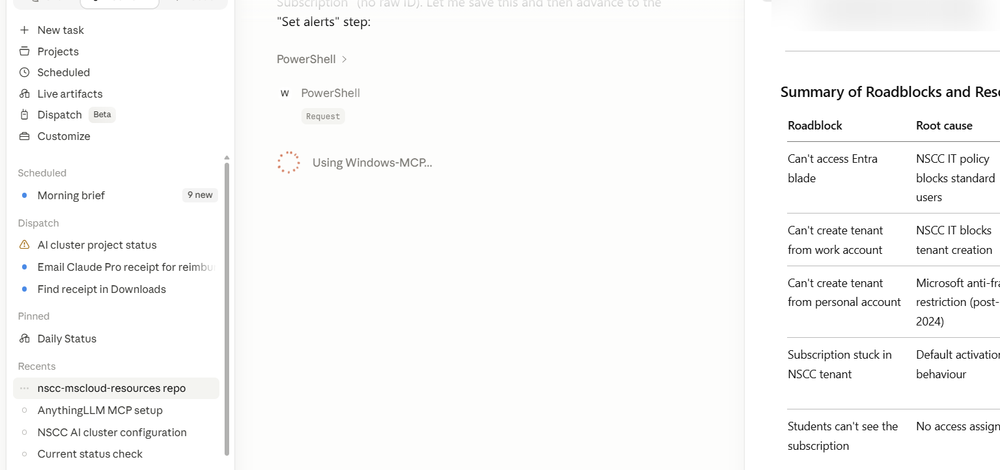
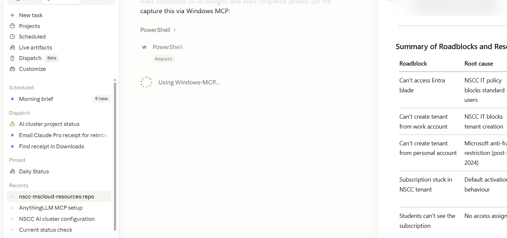

# Getting Started with Your Visual Studio Enterprise Subscription

This guide walks you through activating your subscription, accessing Azure credits, and setting up your development environment.

---

## 1. Activating your subscription

1. Go to [my.visualstudio.com](https://my.visualstudio.com) and sign in with your **NSCC email address** (e.g., `jsmith@nscc.ca`).
2. On the **Benefits** tab, locate **Azure** and click **Activate**.
3. Follow the prompts to create or link an Azure account. You will be asked to agree to the Azure terms of service.
4. Once activated, your subscription will appear at [portal.azure.com](https://portal.azure.com).

> **Note:** If you receive an error during activation, contact the IT Help Desk and reference the Visual Studio Enterprise Pilot.

---

## 2. Understanding your Azure credits

Each subscriber receives approximately **$200 CAD/month** in Azure credits (displayed as ~$150 USD — confirm the exact amount on your Benefits page). Credits do not roll over, and the renewal date varies by subscriber — it is tied to when your subscription was originally activated, not necessarily the first of the month.

Key limits to be aware of:

- Credits cover most Azure services, but some marketplace offerings and reserved instances may be excluded.
- Spending above your credit limit will charge your payment method on file. **Set up spending alerts** (see below).
- Credits cannot be used for production workloads — this subscription is for learning and development only.

---

## 3. Setting up spending alerts

To avoid unexpected charges:

1. In the [Azure Portal](https://portal.azure.com), search for **Cost Management + Billing**.
2. Select **Monitoring → Budgets** → **+ Add**.
3. Set a budget name and amount at or below your monthly credit limit (~CA$200).

   

4. Click **Next** to reach the **Set alerts** step.
5. Add an alert threshold at **80%** of budget, with your NSCC email as the recipient. Add a second at **100%** if desired.

   

---

## 4. Installing developer tools

Your subscription includes several developer tools at no additional cost:

| Tool | Download |
|------|----------|
| Visual Studio 2022 Enterprise | [my.visualstudio.com](https://my.visualstudio.com) → Downloads |
| Azure CLI | [docs.microsoft.com/cli/azure/install-azure-cli](https://learn.microsoft.com/cli/azure/install-azure-cli) |
| Azure PowerShell | `Install-Module -Name Az -Scope CurrentUser` |
| Visual Studio Code | [code.visualstudio.com](https://code.visualstudio.com) |

---

## 5. Connecting to Azure from the command line

**Azure CLI:**
```bash
az login
az account show
```

**Azure PowerShell:**
```powershell
Connect-AzAccount
Get-AzSubscription
```

---

## 6. Next steps

- Browse [docs/resources/](resources/) for an overview of available Azure services.
- Try a hands-on exercise in [labs/](../labs/).
- Review the [scripts/](../scripts/) folder for reusable automation examples.

---

## Getting help

- NSCC IT Help Desk — refer to the pilot program when contacting support.
- [Azure documentation](https://learn.microsoft.com/azure)
- [Visual Studio subscriber support](https://visualstudio.microsoft.com/subscriptions/support/)
