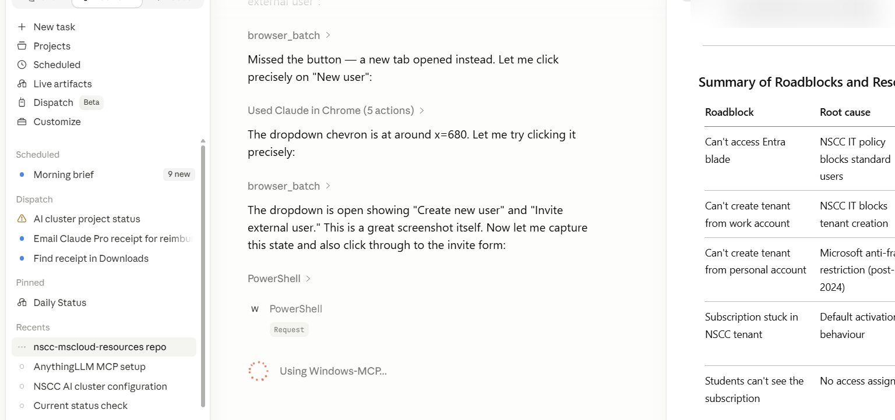
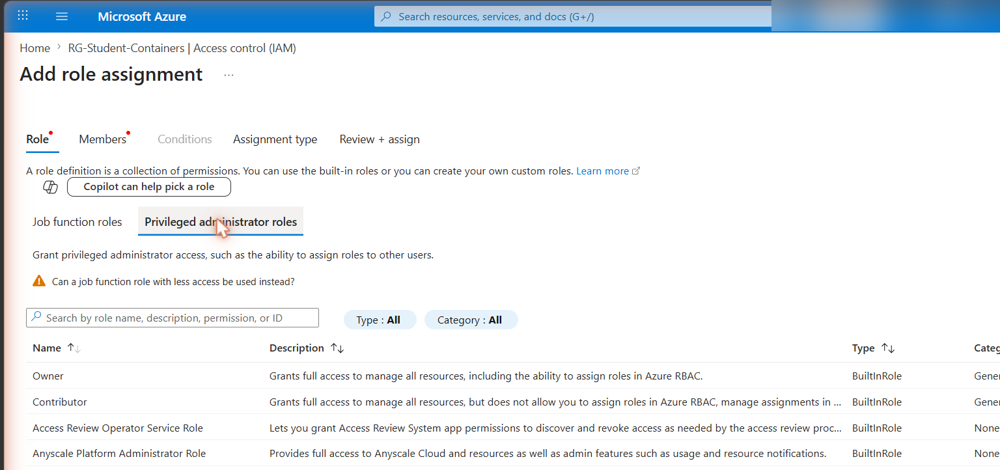

# Tenant Setup & Student IAM Access

This document covers the known roadblocks encountered when setting up the NSCC Visual Studio Enterprise subscription for student use, and the workarounds that resolved them.

---

## Subscription Overview

The pilot subscription can be verified at [my.visualstudio.com/subscriptions](https://my.visualstudio.com/subscriptions).

| Field | Value |
|-------|-------|
| Program | Visual Studio Enterprise |
| Type | CC (institution-assigned) |
| Valid through | 31 Aug 2028 |
| VS Subscription ID | *see my.visualstudio.com/subscriptions* |
| Azure Subscription ID | *see Azure Portal → Subscriptions* |
| Alternate account | *personal MSA — see Alternate account section* |

> **VS Subscription ID vs Azure Subscription ID:** These are two different things. The VS Subscription ID identifies your program membership at my.visualstudio.com. The Azure Subscription ID is the billing container created when you activate the Azure credit benefit — it's what appears in the Azure Portal and CLI.

The **alternate account** (a personal MSA) is configured under the Subscriptions page → *Alternate account* section. This is what allows a personal identity to activate benefits (including the M365 Developer Sandbox) without going through the NSCC-restricted account.

---

## The Core Problem

When you activate a Visual Studio Enterprise subscription using your **NSCC work account**, the resulting Azure subscription is attached to **NSCC's Entra ID tenant**. As a standard user in that tenant, you have no admin rights — you cannot:

- Invite guest users (students)
- Create resource groups for student use with delegated access
- Access the Entra ID admin blade at all (NSCC IT has restricted portal access)
- Create a new tenant from your work account

The subscription is essentially stuck in "corporate jail."

---

## Phase 1 — Getting a Usable Tenant

### Why you can't use the NSCC tenant

The NSCC Entra tenant is fully managed by NSCC IT. Even though your VS Enterprise subscription appeared in it, you have no rights to invite students, create groups, or manage identity. Attempting to access the Entra blade returns an access denied error.

### Why you can't just create a new tenant

The natural next step — creating a fresh sandbox tenant — is blocked in two ways:

1. **From your NSCC work account:** The "Create" option under Manage Tenants is greyed out. NSCC IT policy blocks standard users from creating new tenants.

2. **From a personal Microsoft account (e.g., `@outlook.com`):** As of late 2024/early 2025, Microsoft disabled direct tenant creation for personal accounts without a paid Entra P1/P2 license, as an anti-fraud measure. The "Create" button is greyed out here too.

### The workaround: Force tenant creation via Azure Free signup

The trick is that signing up for an **Azure Free Account** forces Microsoft to automatically provision a new Entra tenant for you — even when the direct "Create Tenant" button is blocked.

**Steps:**

1. Open a **Private/Incognito browser window** (to avoid auto-login with your NSCC account).
2. Go to [azure.microsoft.com/free](https://azure.microsoft.com/free) and click **Start free**.
3. Sign in with a **personal Microsoft account** (Outlook, Hotmail, Live — not your NSCC email).
   - If you don't have one, create one at [account.microsoft.com](https://account.microsoft.com).
4. Complete the signup. You will be asked to verify a phone number (a credit card may also be required for identity verification, but won't be charged unless you explicitly remove the spending limit).
5. Once signup completes, Azure will drop you into a brand new tenant — something like `yourname.onmicrosoft.com`.

> **You don't need or want to use the "Free Trial" subscription that gets created here.** The only thing you're after is the new tenant (directory). The free trial subscription can be ignored.

---

## Phase 2 — Linking Your Work Account to the New Tenant

Now that you have a tenant your personal account controls, invite your NSCC work account as a Global Administrator.

1. Still logged in as your **personal account** in the new tenant:
2. Go to **Microsoft Entra ID → Users → New user → Invite external user**.
3. Enter your **NSCC work email** (e.g., `matt.redmond@nscc.ca`).
4. Before sending the invite, set the role to **Global Administrator**.
   - This is critical — if you invite yourself without admin rights, you'll be locked out of managing the tenant later.
5. Send the invite.
6. Check your NSCC inbox and **Accept** the invitation.

---

## Phase 3 — Moving the Subscription to the New Tenant

With your NSCC work account now a Global Admin in the new tenant, you can transfer the VS Enterprise subscription.

1. Log in to [portal.azure.com](https://portal.azure.com) with your **NSCC work account**.
2. Make sure you're in the **original NSCC directory** (where the subscription currently lives). Use the **Settings (gear icon) → Directories + subscriptions** to confirm and switch if needed.
3. Go to **Subscriptions** and click your **Visual Studio Enterprise** subscription.
4. In the top menu, click **Change Directory**.
5. In the "To directory" dropdown, select your new sandbox tenant (e.g., `yourname.onmicrosoft.com`).
6. Click **Change** and confirm.

> This process takes **10–15 minutes** to complete. The subscription is not cancelled and credits are not affected — only the management context (which tenant "owns" it) changes.

7. After it completes, switch your portal context to the new tenant. Go to **Subscriptions** — you should now see the VS Enterprise subscription listed there.

---

## Phase 4 — Setting Up Student Access via IAM

With the subscription in a tenant you control, you can invite students and scope their access safely.

> **Important:** Do not grant students access at the subscription level. Scope their permissions to a specific Resource Group only. This limits blast radius if a student makes a mistake.

### Step 1 — Create a sandbox Resource Group

In the Azure Portal (in your new tenant):

```
Resource Groups → Create
Name:   RG-Student-Containers   (or similar)
Region: Canada East
```

### Step 2 — Invite students as Guest Users

1. Go to **Microsoft Entra ID → Users → New user → Invite external user**.

   

2. Enter the student's email address.
3. They will receive an invitation email with an "Accept invitation" link.
4. Once accepted, they appear as Guest users in your tenant.

### Step 3 — Assign Contributor role on the Resource Group

1. Open the **RG-Student-Containers** Resource Group.
2. Go to **Access control (IAM) → Add → Add role assignment**.
3. On the role selection screen you'll see two tabs: **Job function roles** and **Privileged administrator roles**. **Contributor lives under the Privileged administrator roles tab** — it's not in the default job function list.

   

4. Select **Contributor** and proceed to the Members tab.
5. Select the invited student(s) and save.

> If the Add button is greyed out, you don't have Owner or User Access Administrator rights on this Resource Group. Check your own role assignment first.

### The student experience

Students log in to [portal.azure.com](https://portal.azure.com) with their own credentials. They must then:

1. Click their **profile icon (top right)**.
2. Select **Switch directory**.
3. Choose your tenant.

Once switched, they will only see the Resource Group(s) they've been granted access to.

---

## Credit Burn Warning

Azure Container Instances are billed per vCPU/second. With 20+ students and containers left running:

- A single small container (~0.5 vCPU) costs roughly $0.02–0.03/hour.
- 20 students × 24 hours = potentially $10–15/day, or $200 CAD (~$150 USD) in a week — your entire monthly credit.

> **Monthly credit:** approximately **$200 CAD / ~$150 USD** per subscriber. The renewal date is tied to your original activation date, not the first of the month — it may fall mid-month or toward month-end.

**Mitigations:**
- Set a **Budget Alert** on the Resource Group (Cost Management → Budgets) at 50% and 90% of your monthly credit.
- Instruct students to **delete their container** immediately after the lab — not just stop it.
- After class, **delete the entire Resource Group** to guarantee all resources are gone. You can recreate it next session.

> Budget alerts warn you via email but do **not** automatically stop resources. Deletion is the only guaranteed cleanup.

---

## M365 Developer Sandbox

The Microsoft 365 Developer Sandbox (a renewable 90-day M365 E5 tenant with 25 user licenses and sample data) is a separate benefit within the VS Enterprise subscription. It is **not** the same as the Azure credits — it's a full M365 tenant you control, useful for testing Entra ID, Intune, Teams, SharePoint, and Conditional Access policies.

### Activation path

Initiate activation directly from the **VS Enterprise benefits portal**, not the public developer program page — this is the subscriber-specific path and bypasses some standard-user restrictions:

1. Go to [my.visualstudio.com/benefits](https://my.visualstudio.com/benefits).
2. Find the **Microsoft 365 Developer Subscription (E5)** tile and click **Get Started**.
3. Choose a domain name (e.g., `nscclab2026.onmicrosoft.com`).
4. Complete phone verification.

### Known blocker: phone verification loop

Microsoft enforces a **one-account-per-phone-number** policy to prevent abuse. If you see "this phone number is already linked to another profile," it means a previous developer profile (possibly from an old work or personal account) is still holding your number.

**Resolution options, in order of preference:**

1. **Find and delete the old profile** — Log in to the [M365 Developer Dashboard](https://developer.microsoft.com/microsoft-365/profile) with any previous email addresses you may have used. Delete the profile. Note: Microsoft typically imposes a **60-day waiting period** before the same number can be reused.

2. **Use a different phone number** — The number is only used for the one-time verification during signup. A trusted colleague's or family member's number works. Do not use VoIP/Google Voice — the system rejects these.

3. **Contact VS subscriber support** — As an Enterprise subscriber you have access to paid support. Explain you are unable to activate your included M365 benefit due to a phone verification conflict. They can sometimes manually reset eligibility. Use the [Visual Studio Subscription Support](https://visualstudio.microsoft.com/subscriptions/support/) page and include the MS-CorrelationId from any error screens.

### Linking the M365 sandbox to your Azure credits (optional)

Once you have the M365 sandbox tenant, you can optionally move your Azure subscription into it (using the **Change Directory** steps in Phase 3 above). This gives you a single tenant with both Azure resources and M365 admin — a full "corporate simulation" environment useful for courses covering Intune, Autopilot, or hybrid identity.

### Two resolution paths for the tenant problem

If the sandbox still provisions into the NSCC tenant (unlikely after completing Phase 2–3 above, but worth noting):

| Option | How | Trade-off |
|--------|-----|-----------|
| Add a personal alternate account | [my.visualstudio.com](https://my.visualstudio.com) → your subscription → **Add alternate account** → enter personal MSA | Benefit activates under personal identity; keeps NSCC as primary login. **This is the approach used for this pilot.** |
| Transfer subscription to personal account | Full subscription transfer to personal MSA via Azure Subscriptions → Change Directory | Cleanest; severs NSCC identity from the subscription entirely |

**To add an alternate account:**
1. Go to [my.visualstudio.com/subscriptions](https://my.visualstudio.com/subscriptions).
2. Click your **Visual Studio Enterprise** subscription.
3. Scroll to the **Alternate account** section at the bottom of the page.
4. Enter a personal Microsoft account email (Gmail, Outlook, etc.) and save.
5. Benefits activated from that point forward can be initiated under the alternate account identity.

---

## Summary of Roadblocks and Resolutions

| Roadblock | Root cause | Resolution |
|-----------|------------|------------|
| Can't access Entra blade | NSCC IT policy blocks standard users | N/A — must leave NSCC tenant |
| Can't create tenant from work account | NSCC IT blocks tenant creation | Use personal account |
| Can't create tenant from personal account | Microsoft anti-fraud restriction (post-2024) | Trigger via Azure Free signup flow |
| Subscription stuck in NSCC tenant | Default activation behaviour | Change Directory after gaining admin rights in new tenant |
| Students can't see the subscription | No access assigned | Invite as Guest + Contributor on Resource Group |
| M365 Dev Sandbox blocked | NSCC tenant controls | Add personal email to benefits, or transfer subscription |
